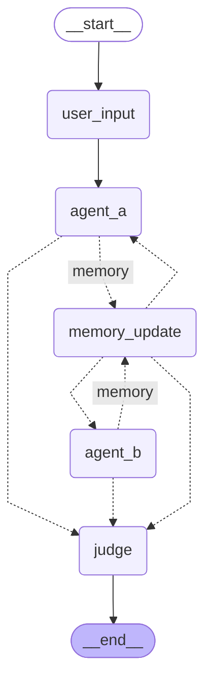

```mermaid
---
config:
  flowchart:
    curve: linear
---
graph TD;
	__start__([<p>__start__</p>]):::first
	user_input(user_input)
	agent_a(agent_a)
	agent_b(agent_b)
	memory_update(memory_update)
	judge(judge)
	__end__([<p>__end__</p>]):::last
	__start__ --> user_input;
	agent_a -.-> judge;
	agent_a -. &nbsp;memory&nbsp; .-> memory_update;
	agent_b -.-> judge;
	agent_b -. &nbsp;memory&nbsp; .-> memory_update;
	memory_update -.-> agent_a;
	memory_update -.-> agent_b;
	memory_update -.-> judge;
	user_input --> agent_a;
	judge --> __end__;
	classDef default fill:#f2f0ff,line-height:1.2
	classDef first fill-opacity:0
	classDef last fill:#bfb6fc

```
